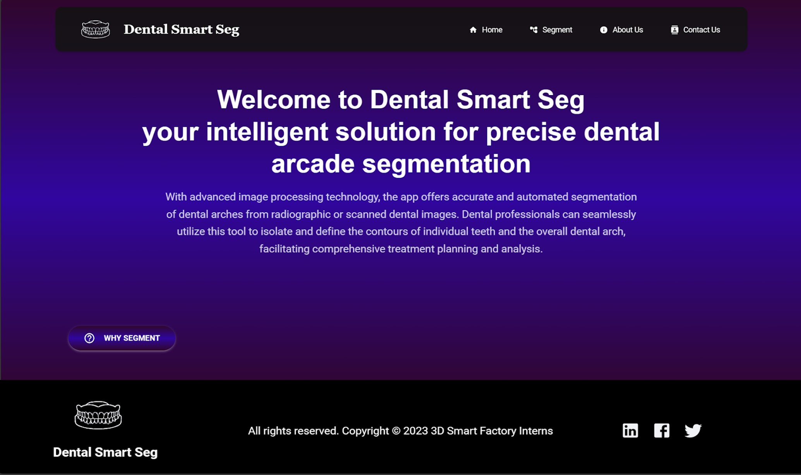

# Web-App-for-3D-Object-Dental-Arches-segmentation

Welcome to our cutting-edge web application project that aims to revolutionize 3D object segmentationof dental arches! Our goal is to provide users with a seamless and interactive experience, allowing them to upload 3D objects and receive accurate segmentation results. This project harnesses the power of ReactJS, VTK.js, FastAPI, and Machine Learning models to achieve a state-of-the-art web app that is both intuitive and powerful.

## For more details checkout the branches :

- frontend -> for the frontend part using ReactJS
- API-backend -> for the backend part using FastAPI

